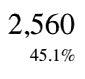

# Appendix E. Statistics

> LORD DIMWIT FLATHEAD: "It must have two hundred thousand rooms, four million takeable objects, and understand a vocabulary of every single word ever spoken in every language ever invented."
>
> _**The New Zork Times** (Winter 1984)_

[Note: the information below has not been updated since the 20th June 1997 revision of this document.]

To give some idea of the sizes found in typical story files, here are a few statistics, mostly gathered by Paul David Doherty, whose _Infocom fact sheet_ file is the definitive reference.

## Length

The shortest files are those dating from the time of the _Zork_ trilogy, at about 85K; middle-period Version 3 games are typically 105K, and only the latest use the full memory map. In Versions 4 and 5, only _Trinity_, _A Mind Forever Voyaging_ and _Beyond Zork_ use the full 256K. _Border Zone_ and _Sherlock_, for instance, are about 180K. (The author's short story _Balances_ is about 50K, an edition of _Adventure_ takes 80K, and _Curses_ takes 256K (it's padded out to the maximum size with background information; the actual game comprises only about 245K). Under Inform, the library occupies about 35K regardless of the size of game.)

## Code size

_Zork I_ uses only about 5500 opcodes, but the number rises steeply with later games; _Hollywood Hijinx_ has 10355 and, e.g. _Moonmist_ has 15900 (both these being Version 3). Against this, _A Mind Forever Voyaging_ has only 18700, and only _Trinity_ and _Beyond Zork_ reach 32000 or so. (Inform games are more efficiently compiled and make better use of common code --- the library --- so perform much better here: the old Version 3, release 10 of _Curses_ (128K long, and a larger game than any Infocom Version 3 game) has only 6720 opcodes.)

## Objects and rooms

This varies greatly with the style of game. _Zork I_ has 110 rooms and 60 takeable objects, but several quite complex games have as few as 30 rooms (the mysteries, or 'Hitch-hikers'). The average for Version 3 games is 69 rooms, 39 takeable objects.

_A Mind Forever Voyaging_ contains many rooms (178) but few objects (30). _Trinity_, a more typical style of game, contains 134 rooms and 49 objects: the Version 5 _Curses_ has a few more of each. Of the Version 6 games, only _Zork Zero_ scores highly here, with 215 rooms and 106 objects. The average for Version 4/5 games is 105 rooms and 54 objects.

The total number of objects tends to be close to the limit of 255 in Version 3 games. _Curses_ contains 508.

## Dictionary

Early games such as _Zork I_ know about 600 words, but again this rises steeply to about 1000 even in Version 3. Later games know 1569 ( _Beyond Zork_) to the record, 2120 ( _Trinity_). (This is achieved by heroic inclusion of unlikely synonyms: e.g. the Japanese lady with the umbrella can be called `WOMAN`, `LADY`, `CRONE`, `MADAM`, `MADAME`, `MATRON`, `DAME` or `FACE` with any of the adjectives `OLD`, `AGED`, `ANCIENT`, `JAP`, `JAPANESE`, `ORIENTAL` or `YELLOW`.) Version 6 games have smaller dictionaries. So has _Curses_, at 1364.

## Opcodes

(a) Of the 1426854 opcodes in the shipped Infocom story files in Paul David Doherty's collection, here are the top and bottom ten most popular. (Leaving out those which never occur and so score 0: **`nop`**, **`art_shift`**, **`piracy`** and the two post-Infocom opcodes, **`print_unicode`** and **`check_unicode`**.)

**Top Ten Opcodes Chart**

| Number | Opcode                                                  |  Count |
| :----: | :------------------------------------------------------ | -----: |
|   1    | [**`je`**](./15-opcodes-dictionary.md#je)               | 195959 |
|   2    | [**`print`**](./15-opcodes-dictionary.md#print)         | 142755 |
|   3    | [**`jz`**](./15-opcodes-dictionary.md#jz)               | 112016 |
|   4    | [**`call_vs`**](./15-opcodes-dictionary.md#call_vs)     | 104075 |
|   5    | [**`print_ret`**](./15-opcodes-dictionary.md#print_ret) |  80870 |
|   6    | [**`store`**](./15-opcodes-dictionary.md#store)         |  71128 |
|   7    | [**`rtrue`**](./15-opcodes-dictionary.md#rtrue)         |  66125 |
|   8    | [**`jump`**](./15-opcodes-dictionary.md#jump)           |  56534 |
|   9    | [**`new_line`**](./15-opcodes-dictionary.md#new_line)   |  52553 |
|   10   | [**`test_attr`**](./15-opcodes-dictionary.md#test_attr) |  46627 |

**Bottom Ten Opcodes Chart**

| Number | Opcode                                                          | Count |
| :----: | :-------------------------------------------------------------- | ----: |
|   1    | [**`print_form`**](./15-opcodes-dictionary.md#print_form)       |     2 |
|   2    | [**`erase_picture`**](./15-opcodes-dictionary.md#erase_picture) |     3 |
|   3    | [**`read_mouse`**](./15-opcodes-dictionary.md#read_mouse)       |     3 |
|   4    | [**`encode_text`**](./15-opcodes-dictionary.md#encode_text)     |     7 |
|   5    | [**`make_menu`**](./15-opcodes-dictionary.md#make_menu)         |     9 |
|   6    | [**`not`**](./15-opcodes-dictionary.md#not)                     |    14 |
|   7    | [**`scroll_window`**](./15-opcodes-dictionary.md#scroll_window) |    16 |
|   8    | [**`pop_stack`**](./15-opcodes-dictionary.md#pop_stack)         |    17 |
|   9    | [**`restore_undo`**](./15-opcodes-dictionary.md#restore_undo)   |    18 |
|   10   | [**`mouse_window`**](./15-opcodes-dictionary.md#mouse_window)   |    22 |

So about 2/3rds of all opcodes are those in the top ten; 1 in 8 opcodes is a [**`je`**](./15-opcodes-dictionary.md#je), and only 1 in 710000 is a [**`print_form`**](./15-opcodes-dictionary.md#print_form).

(b) An experiment (conducted with the help of Kevin Bracey) sheds some light on the opcodes most frequently interpreted in typical play. Two very different games (_Zork I_, Version 5 "solid gold" edition; _Museum of Inform_, a complex Inform example game) were played for about 50000 cycles of the Z-machine (about 20 moves in _Zork I_, rather less in the _Museum_). The following table records all opcodes with a frequency of at least 1% (i.e., 0.01):

**Zork I Solid Gold (Infocom)**

| Frequency | Opcode                                                      |
| :-------- | :---------------------------------------------------------- |
| 0.116110  | [**`loadb`**](./15-opcodes-dictionary.md#loadb)             |
| 0.103990  | [**`storeb`**](./15-opcodes-dictionary.md#storeb)           |
| 0.101616  | [**`jz`**](./15-opcodes-dictionary.md#jz)                   |
| 0.074979  | [**`dec_chk`**](./15-opcodes-dictionary.md#dec_chk)         |
| 0.066375  | [**`add`**](./15-opcodes-dictionary.md#add)                 |
| 0.066283  | [**`je`**](./15-opcodes-dictionary.md#je)                   |
| 0.060760  | [**`store`**](./15-opcodes-dictionary.md#store)             |
| 0.053867  | [**`loadw`**](./15-opcodes-dictionary.md#loadw)             |
| 0.038095  | [**`storew`**](./15-opcodes-dictionary.md#storew)           |
| 0.036428  | [**`mul`**](./15-opcodes-dictionary.md#mul)                 |
| 0.032069  | [**`inc_chk`**](./15-opcodes-dictionary.md#inc_chk)         |
| 0.030243  | [**`jump`**](./15-opcodes-dictionary.md#jump)               |
| 0.029170  | [**`test_attr`**](./15-opcodes-dictionary.md#test_attr)     |
| 0.020634  | [**`call_vs`**](./15-opcodes-dictionary.md#call_vs)         |
| 0.011184  | [**`get_sibling`**](./15-opcodes-dictionary.md#get_sibling) |

**Museum of Inform (Inform)**

| Frequency | Opcode                                                          |
| :-------- | :-------------------------------------------------------------- |
| 0.104952  | [**`je`**](./15-opcodes-dictionary.md#je)                       |
| 0.101151  | [**`jz`**](./15-opcodes-dictionary.md#jz)                       |
| 0.092727  | [**`jump`**](./15-opcodes-dictionary.md#jump)                   |
| 0.080985  | [**`jg`**](./15-opcodes-dictionary.md#jg)                       |
| 0.079039  | [**`jl`**](./15-opcodes-dictionary.md#jl)                       |
| 0.070550  | [**`inc`**](./15-opcodes-dictionary.md#inc)                     |
| 0.070139  | [**`store`**](./15-opcodes-dictionary.md#store)                 |
| 0.047058  | [**`loadw`**](./15-opcodes-dictionary.md#loadw)                 |
| 0.034137  | [**`get_prop_addr`**](./15-opcodes-dictionary.md#get_prop_addr) |
| 0.024105  | [**`jin`**](./15-opcodes-dictionary.md#jin)                     |
| 0.022734  | [**`rtrue`**](./15-opcodes-dictionary.md#rtrue)                 |
| 0.021583  | [**`storew`**](./15-opcodes-dictionary.md#storew)               |
| 0.020075  | [**`add`**](./15-opcodes-dictionary.md#add)                     |
| 0.018485  | [**`call_vs`**](./15-opcodes-dictionary.md#call_vs)             |
| 0.016731  | [**`and`**](./15-opcodes-dictionary.md#and)                     |
| 0.016082  | [**`loadb`**](./15-opcodes-dictionary.md#loadb)                 |
| 0.012061  | [**`call_vn`**](./15-opcodes-dictionary.md#call_vn)             |
| 0.011879  | [**`test_attr`**](./15-opcodes-dictionary.md#test_attr)         |
| 0.011824  | [**`dec`**](./15-opcodes-dictionary.md#dec)                     |
| 0.011687  | [**`ret`**](./15-opcodes-dictionary.md#ret)                     |

Adventure games spend most of the time parsing, and the differences between these tables reflect different parser designs (byte arrays versus word arrays and arrays stored in properties) as well as different compiler code generators (Inform does not use [**`inc_chk`**](./15-opcodes-dictionary.md#inc_chk) or [**`dec_chk`**](./15-opcodes-dictionary.md#dec_chk), so it uses [**`inc`**](./15-opcodes-dictionary.md#inc), [**`dec`**](./15-opcodes-dictionary.md#dec), [**`jl`**](./15-opcodes-dictionary.md#jl) and [**`jg`**](./15-opcodes-dictionary.md#jq) correspondingly more). In the case of _Zork I_, about a third of all opcodes are branches: in the case of _Museum_, almost half.
